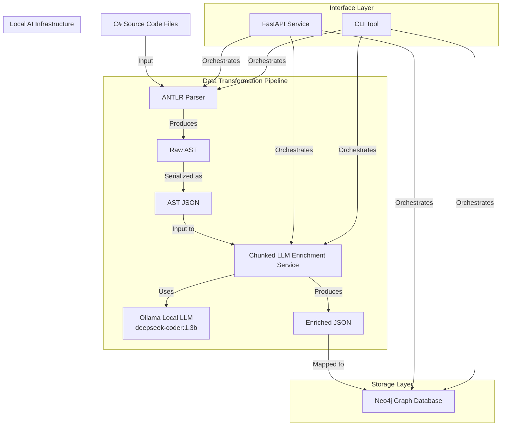
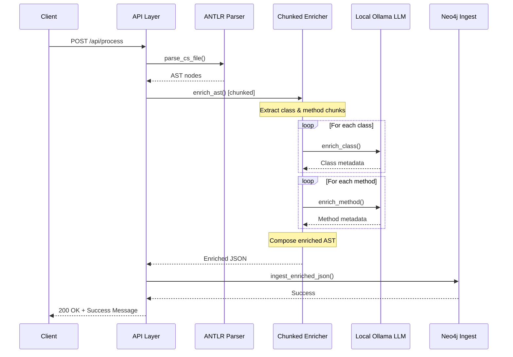

# Project Architecture: C# → Neo4j Code Graph Extractor

## 1. Overview

This project extracts semantic relationships from legacy **C# (.NET 4.0)** codebases and stores them as a graph in **Neo4j**. It uses a combination of deterministic parsing (ANTLR) and **local LLM enrichment via Ollama (deepseek-coder:1.3b)** for advanced insights while maintaining data security. The system is designed following microservices principles with clearly separated components communicating through well-defined interfaces.

---

## 2. System Architecture Diagram



---

## 3. Folder Structure (Simplified)

``` folder structure
csharp-graph-pipeline/
├── grammar/            # ANTLR grammar files for C#
├── generated/          # Auto-generated parser classes
├── input_code/         # Raw input .cs files
├── parsed_output/      # AST in JSON format
├── enriched_output/    # LLM-enriched version of AST
├── prompt_templates/   # Prompting blueprints for LLM
├── pipeline/           # Parser, Enricher, Neo4j Ingest
│   ├── cs_parser.py    # ANTLR-based C# parsing
│   ├── enrich.py       # LLM-based AST enrichment
│   ├── insert_graph.py # Neo4j ingestion logic
│   └── models.py       # Neo4j schema definitions
├── api/                # FastAPI app for serving the pipeline
│   ├── main.py         # API entry point
│   └── routers/        # API endpoint definitions
│       └── process_code.py # Code processing endpoints
├── tests/              # Unit & integration tests
│   ├── test_cs_parser.py
│   ├── test_enrich.py
│   ├── test_insert_graph.py
│   └── test_api.py
├── docs/               # Documentation (you're here!)
├── scripts/            # Utility scripts
│   ├── generate_parser.sh  # ANTLR parser generator 
│   └── run_tests.sh    # Test execution script
└── cli.py              # Command line interface
```

---

## 4. Data Flow Architecture

### 4.1 Enhanced Chunked Enrichment Flow

```text
1. [C# Code File] (.cs file from input_code/)
    ⬇
2. [ANTLR Parser] (cs_parser.parse_cs_file)
    ➤ Uses C# grammar to generate an Abstract Syntax Tree (AST)
    ➤ Identifies classes, methods, properties, etc.
    ➤ Outputs list of nodes with type, name, and line number
    ⬇
3. [JSON Serialization] (cs_parser.serialize_to_json)
    ➤ Serialize AST nodes into a clean JSON structure 
    ➤ Writes to parsed_output/file_ast.json
    ⬇
4. [Chunked LLM Enrichment] (enrich.enrich_ast)
    ➤ Extracts class and method chunks from AST
    ➤ Processes classes separately for class-level metadata
    ➤ Processes methods individually for method-level insights
    ➤ Uses local Ollama API (deepseek-coder:1.3b) for security
    ➤ Combines original AST with structured enrichments
    ➤ Writes to enriched_output/file_enriched.json
    ⬇
5. [Neo4j Insertion] (insert_graph.ingest_enriched_json)
    ➤ Maps enriched JSON to graph schema defined in models.py
    ➤ Creates CodeEntity nodes for classes, methods, etc.
    ➤ Establishes relationships: CONTAINS, DEPENDS_ON
    ➤ Stores enriched metadata as node properties
    ⬇
6. [Neo4j Graph Database]
    ➤ Final result is a visual and queryable graph:
        - Nodes: Code entities (classes, methods, etc.)
        - Edges: Dependencies, containment, call graphs
        - Properties: Line numbers, summaries, tags, enriched metadata
```

### 4.2 Chunked Enrichment Strategy

The enhanced enrichment process uses a **chunked strategy** to improve reliability and reduce JSON parsing errors:

1. **Class-Level Enrichment**: Each class is analyzed separately for architectural patterns, design intent, and high-level dependencies
2. **Method-Level Enrichment**: Individual methods are analyzed for functionality, patterns, and specific dependencies
3. **Composition**: Class and method enrichments are merged into the final enriched AST structure
4. **Fallback Handling**: Mock enrichment provides fallbacks when LLM calls fail

#### Benefits of Chunked Approach:
- **Improved Reliability**: Smaller, focused prompts reduce LLM parsing errors
- **Better Context**: Specialized prompts for classes vs methods provide more relevant insights
- **Fault Tolerance**: Individual chunk failures don't affect the entire enrichment process
- **Scalability**: Can process large codebases by handling components independently

### 4.3 Data Format Examples

#### AST JSON Example (Output of Parser)
```json
[
  {
    "type": "Class",
    "name": "CustomerController",
    "startLine": 3
  },
  {
    "type": "Method",
    "name": "GetAllCustomers",
    "startLine": 4
  }
]
```

#### Enhanced Enriched JSON Example (Chunked Output)
```json
{
  "ast": [
    {
      "type": "Class",
      "name": "CustomerController",
      "startLine": 3,
      "enrichment": {
        "summary": "API controller for customer data management with CRUD operations",
        "tags": ["controller", "api", "web", "crud"],
        "dependencies": ["CustomerService", "IActionResult"]
      },
      "body": [
        {
          "type": "Method",
          "name": "GetAllCustomers",
          "startLine": 4,
          "enrichment": {
            "summary": "Retrieves all customers from the system",
            "tags": ["getter", "query", "read"],
            "dependencies": ["CustomerService", "IEnumerable"]
          }
        }
      ]
    }
  ],
  "summary": "CustomerController: API controller for customer data management with CRUD operations",
  "dependencies": ["CustomerService", "IActionResult", "IEnumerable"],
  "tags": ["controller", "api", "web", "crud", "getter", "query", "read"],
  "processing_info": {
    "classes_processed": 1,
    "methods_processed": 1,
    "strategy": "chunked"
  }
}
```

#### Neo4j Graph Representation
```cypher
// Nodes
(file:CodeEntity {uid: "File:CustomerController.cs", name: "CustomerController.cs", type: "File"})
(class:CodeEntity {uid: "Class:CustomerController", name: "CustomerController", type: "Class"})
(method:CodeEntity {uid: "Method:GetAllCustomers", name: "GetAllCustomers", type: "Method"})
(dependency:CodeEntity {uid: "Class:CustomerRepository", name: "CustomerRepository", type: "Class"})

// Relationships
(file)-[:CONTAINS]->(class)
(class)-[:CONTAINS]->(method)
(class)-[:DEPENDS_ON]->(dependency)
```

---

## 5. API Architecture

The API layer provides HTTP access to the pipeline using a RESTful architecture:

```
Client Request → FastAPI App (main.py) → Router (process_code.py) → Pipeline Components
```

### 5.1 API Endpoints

| Endpoint      | Method | Description                         | Request Body                    | Response                              |
|---------------|--------|-------------------------------------|--------------------------------|---------------------------------------|
| `/`           | GET    | Health check and API info           | None                           | API status and available endpoints    |
| `/api/process`| POST   | Process a C# file through pipeline  | `{"file_path": "/path/to.cs"}` | Success/failure status with details   |

### 5.2 API Flow

1. **Entry Point**: `main.py` initializes FastAPI and registers routers
2. **Health Check**: `GET /` provides API status and available endpoints
3. **Processing Endpoint**: `POST /api/process` accepts file path in request body
4. **Process Flow**: 
   - Validates input file exists
   - Executes complete processing pipeline
   - Returns success status or appropriate error
5. **Error Handling**:
   - 404 for file not found
   - 422 for invalid request format
   - 500 for pipeline processing errors
   - Input validation via Pydantic models

---

## 6. Component Architecture

### 6.1 Core Components

| Component                    | Description                                                                                                                                           |
| ---------------------------- | ----------------------------------------------------------------------------------------------------------------------------------------------------- |
| `grammar/*.g4`               | ANTLR grammar files defining C# syntax rules, following the C# language specification                                                                 |
| `scripts/generate_parser.sh` | Shell script to compile grammar into Python-compatible parser code, generating visitor classes                                                        |
| `pipeline/cs_parser.py`      | Uses generated ANTLR classes to parse `.cs` files into AST nodes<br>Contains `ASTCollector` visitor that extracts classes, methods, etc. while traversing the parse tree<br>Provides `serialize_to_json` to output AST as JSON |
| `pipeline/enrich.py`         | **Enhanced chunked enrichment system**:<br>• Implements chunked processing strategy for classes and methods<br>• Uses local Ollama API (deepseek-coder:1.3b) for security<br>• Provides specialized class and method enrichment functions<br>• Includes mock enrichment for testing<br>• Handles retry logic and fallback mechanisms<br>• Combines enrichments into structured output |
| `pipeline/models.py`         | Defines Neo4j schema using Neomodel OGM<br>Establishes connection to Neo4j database<br>Defines `CodeEntity` with relationships and properties |
| `pipeline/insert_graph.py`   | Reads enriched JSON<br>Creates `CodeEntity` nodes for file and AST entities<br>Establishes relationships between nodes<br>Stores metadata as node properties |
| `api/main.py`                | Initializes FastAPI application<br>Configures metadata (title, description, etc.)<br>Registers routers and middleware |
| `api/routers/process_code.py`| Defines `/api/process` endpoint<br>Coordinates complete pipeline execution<br>Provides error handling and validation |
| `cli.py`                     | Command-line interface to run pipeline<br>Takes file path as argument<br>Executes complete pipeline in sequence |
| `tests/*.py`                 | Unit and integration tests for each component<br>Uses pytest fixtures and mocks for isolated testing |

### 6.2 Enhanced Component Interaction Diagram



---

## 7. Technology Stack

### 7.1 Core Technologies

| Area                | Tech                                                                            | Version      | Purpose                               |
| ------------------- | ------------------------------------------------------------------------------- | ------------ | ------------------------------------- |
| Parsing             | ANTLR 4.13 (C# Grammar)                                                         | 4.13.0       | Syntax parsing & AST generation       |
| **Local AI**        | **Ollama + deepseek-coder:1.3b**                                               | **Latest**   | **Local LLM for secure code analysis** |
| Enrichment          | Enhanced chunked enrichment pipeline                                            | Custom       | Semantic enrichment & code analysis   |
| Graph Storage       | Neo4j                                                                           | 5.26.0       | Graph database for code relationships |
| Object Graph Mapper | Neomodel                                                                        | 5.0.0        | ORM for Neo4j                         |
| API Layer           | FastAPI + Uvicorn                                                               | 0.100.0      | HTTP API & ASGI server                |
| Testing             | Pytest                                                                          | 7.4.0        | Unit & integration testing            |
| Language            | Python                                                                          | 3.10         | Implementation language               |

### 7.2 Dependencies & Libraries

| Library             | Version | Purpose                                |
|---------------------|---------|----------------------------------------|
| antlr4-python3-runtime | 4.13.0 | Python runtime for ANTLR parser        |
| neomodel            | 5.0.0   | Neo4j OGM                             |
| fastapi             | 0.100.0 | API framework                         |
| uvicorn             | 0.23.0  | ASGI server                           |
| requests            | 2.31.0  | HTTP client for LLM API               |
| python-dotenv       | 1.0.0   | Environment configuration             |
| pytest              | 7.4.0   | Test framework                        |
| pydantic            | 2.0.3   | Data validation                       |

---

## 8. Local LLM Integration Architecture

The system uses **Ollama with deepseek-coder:1.3b** for local LLM processing, ensuring data security and privacy:

### 8.1 Local LLM Integration Flow

1. **Local Setup**: Ollama runs locally at `http://localhost:11434` with deepseek-coder:1.3b model
2. **Chunked Processing**: AST is split into class and method chunks for focused analysis
3. **Specialized Prompts**: Different prompt templates for class-level vs method-level analysis
4. **Retry Mechanism**: Built-in retry logic with exponential backoff for reliability
5. **Fallback System**: Mock enrichment provides fallbacks when LLM is unavailable
6. **Response Parsing**: Advanced JSON extraction handles various LLM response formats

### 8.2 Chunked Enrichment Strategy

The enhanced enrichment system processes code in focused chunks:

#### Class-Level Enrichment:
- **Input**: Class metadata, method names, inheritance information
- **Analysis**: Architectural patterns, design intent, high-level dependencies
- **Output**: Class summary, tags (controller, service, repository), dependencies

#### Method-Level Enrichment:
- **Input**: Individual method data, parameters, return type
- **Analysis**: Method functionality, operation type, specific dependencies
- **Output**: Method summary, operation tags (getter, create, update), dependencies

#### Composition Strategy:
- **Merge**: Combines class and method enrichments into cohesive structure
- **Aggregation**: Creates overall file-level summary from individual components
- **Validation**: Ensures all required fields are present with sensible defaults

### 8.3 Local LLM Benefits

**Data Security:**
- All code analysis happens locally - no external API calls
- Sensitive business logic never leaves the local environment
- Complete control over data processing and storage

**Performance & Reliability:**
- No network latency or external service dependencies
- Consistent availability regardless of internet connectivity
- Predictable response times and resource usage

**Cost Efficiency:**
- No per-token or per-request charges
- One-time setup cost for local infrastructure
- Scales with hardware rather than API usage

### 8.4 Model Selection Rationale

**deepseek-coder:1.3b** was chosen for:
- **Code Specialization**: Specifically trained on code analysis tasks
- **Efficiency**: 1.3B parameters provide good balance of capability and speed
- **Resource Requirements**: Runs efficiently on standard development hardware
- **Context Understanding**: Good performance on C# syntax and patterns

---

## 9. Error Handling & Resilience

The pipeline implements comprehensive error handling:

### 9.1 Input Validation Layer

- File existence check
- File extension validation
- Pydantic models for request validation

### 9.2 Pipeline Exception Handling

- Each stage (parse, enrich, ingest) wrapped in try/except
- Specific error responses based on failure point
- Detailed logging of errors for diagnosis

### 9.3 API Error Response Structure

```json
{
  "detail": "Specific error message with context"
}
```

Error codes:
- 404: File not found
- 422: Invalid request format
- 500: Pipeline processing errors

---

## 10. Scalability & Extension Points

### 10.1 Horizontal Scaling

- API layer can be containerized and scaled horizontally
- LLM enrichment can be parallelized across multiple providers
- Neo4j can be deployed in causal cluster mode for high availability

### 10.2 Extension Points

1. **LLM Provider Agnostic**:
   - `enrich.py` can use any LLM provider by changing endpoint and API key
   - Prompt templates can be customized for different LLMs or languages

2. **Pipeline Modularity**:
   - Each stage operates independently with clear inputs/outputs
   - Components can be replaced or enhanced without affecting others

3. **Future Architecture Extensions**:
   - Support for additional programming languages
   - Batch processing of multiple files
   - Graph querying using natural language via LLM-RAG
   - Integration with code review and quality tools

---

## 11. Security Considerations

### 11.1 Enhanced Data Security with Local LLM

**Local Processing Benefits:**
- **Data Sovereignty**: All code analysis happens on local infrastructure
- **No External Exposure**: Sensitive business logic never transmitted to external services
- **Compliance**: Easier to meet enterprise security and compliance requirements
- **Air-Gapped Operations**: Can operate in secure, isolated environments

**Additional Security Measures:**
1. **API Security**:
   - API keys for authentication (future)
   - Rate limiting to prevent abuse
   - Input validation to prevent injection attacks

2. **Local Data Security**:
   - Credentials stored in environment variables, not hardcoded
   - Temporary files sanitized after processing
   - Neo4j access restricted by authentication
   - Local LLM responses logged securely for debugging

3. **Infrastructure Security**:
   - Ollama service can be configured with access controls
   - Local network isolation for LLM processing
   - Secure storage of model files and configurations

---

## 12. Performance Optimization

### 12.1 Enhanced Performance with Chunked Processing

**Chunked Enrichment Optimizations:**
- **Parallel Processing**: Classes and methods can be processed concurrently
- **Focused Context**: Smaller prompts improve LLM response quality and speed
- **Selective Processing**: Can skip enrichment for certain entity types if needed
- **Batch Operations**: Process multiple chunks in batches for efficiency

**Local LLM Optimizations:**
- **Model Caching**: deepseek-coder:1.3b loads once and stays in memory
- **Response Optimization**: Configured for deterministic, concise responses
- **Timeout Management**: Appropriate timeouts prevent hanging requests
- **Resource Management**: Monitoring and limiting concurrent LLM requests

3. **API Optimizations**:
   - Asynchronous handling of long-running tasks
   - Response caching where appropriate
   - Background processing for large codebases
   - **Local LLM eliminates external API latency**

---

## 13. Deployment and Scaling Considerations

### 13.1 Local LLM Infrastructure Requirements

**Hardware Requirements:**
- **Minimum**: 8GB RAM, 4 CPU cores for deepseek-coder:1.3b
- **Recommended**: 16GB RAM, 8 CPU cores for optimal performance
- **Storage**: 2GB for model files, additional space for processing data

**Software Dependencies:**
- Ollama service running locally
- deepseek-coder:1.3b model downloaded and available
- Python environment with all project dependencies

### 13.2 Scaling Strategies

**Horizontal Scaling:**
- Multiple Ollama instances can run on different ports/machines
- Load balancing between multiple local LLM instances
- Distributed processing of large codebases across multiple nodes

**Vertical Scaling:**
- Upgrade to larger models (deepseek-coder:6.7b) for better accuracy
- Increase hardware resources for faster processing
- Optimize batch sizes based on available memory

### 13.3 High Availability

**Failover Mechanisms:**
- Mock enrichment provides immediate fallback when LLM is unavailable
- Health checks for Ollama service status
- Graceful degradation with partial enrichment when needed

**Monitoring and Observability:**
- LLM request/response logging for debugging and optimization
- Performance metrics for enrichment processing times
- Resource usage monitoring for Ollama service