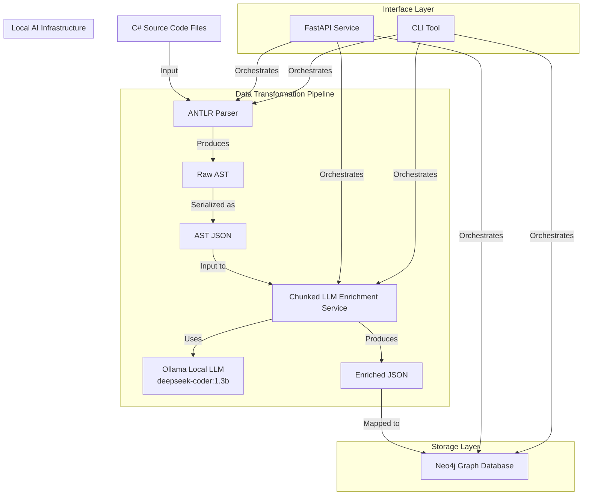

```mermaid
graph TD
    A[C# Source Code Files] -->|Input| B[ANTLR Parser]
    B -->|Produces| C[Raw AST]
    C -->|Serialized as| D[AST JSON]
    D -->|Input to| E[Chunked LLM Enrichment Service]
    E -->|Uses| OL[Ollama Local LLM<br/>deepseek-coder:1.3b]
    E -->|Produces| F[Enriched JSON]
    F -->|Mapped to| G[Neo4j Graph Database]
    
    H[FastAPI Service] -->|Orchestrates| B
    H -->|Orchestrates| E
    H -->|Orchestrates| G
    
    I[CLI Tool] -->|Orchestrates| B
    I -->|Orchestrates| E
    I -->|Orchestrates| G
    
    subgraph "Data Transformation Pipeline"
        B
        C
        D
        E
        OL
        F
    end
    
    subgraph "Storage Layer"
        G
    end
    
    subgraph "Interface Layer"
        H
        I
    end
    
    subgraph "Local AI Infrastructure"
        OL
    end
```

