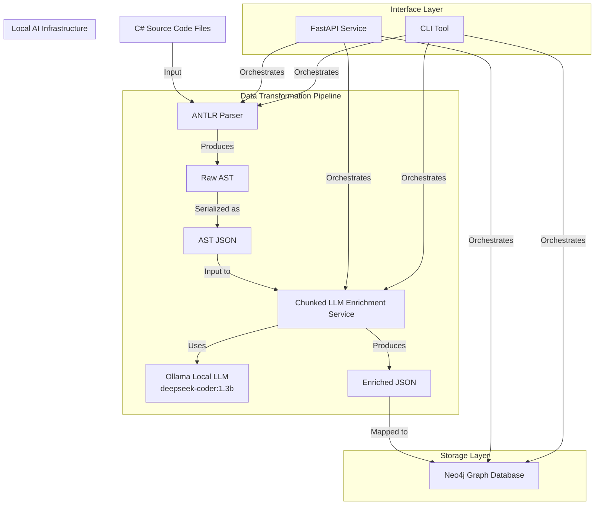

## 1. Data Flow Architecture

### 1.1 Graphical Representation Of Workflow



### 1.2 Enhanced Chunked Enrichment Flow

```text
1. [C# Code File] (from input_code/)
    ⬇
2. [ANTLR Parser] 
    ➤ Uses C# grammar to generate an Abstract Syntax Tree (AST)
    ➤ Identifies classes, methods, properties, etc.
    ➤ Outputs list of nodes with type, name, and line number
    ⬇
3. [JSON Serialization] 
    ➤ Serialize AST nodes into a clean JSON structure 
    ➤ Writes to parsed_output/file_ast.json
    ⬇
4. [Chunked LLM Enrichment] 
    ➤ Extracts class and method chunks from AST
    ➤ Processes classes separately for class-level metadata
    ➤ Processes methods individually for method-level insights
    ➤ Uses local Ollama API (deepseek-coder:1.3b) for security
    ➤ Combines original AST with structured enrichments
    ⬇
5. [Neo4j Insertion]
    ➤ Maps enriched JSON to graph schema defined in models.py
    ➤ Creates CodeEntity nodes for classes, methods, etc.
    ➤ Establishes relationships: CONTAINS, DEPENDS_ON
    ➤ Stores enriched metadata as node properties
    ⬇
6. [Neo4j Graph Database]
    ➤ Final result is a visual and queryable graph:
        - Nodes: Code entities (classes, methods, etc.)
        - Edges: Dependencies, containment, call graphs
        - Properties: Line numbers, summaries, tags, enriched metadata
```
